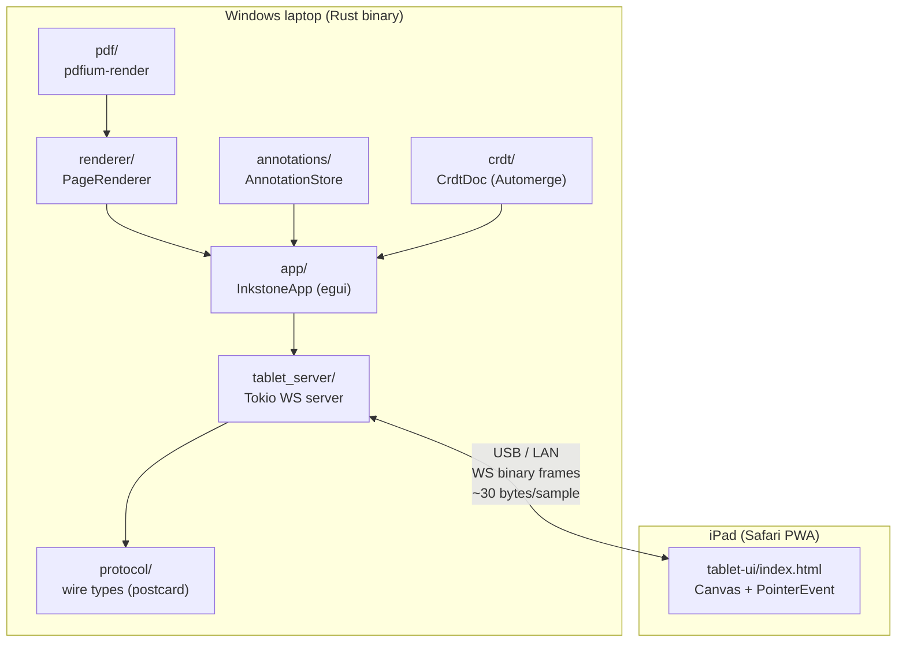
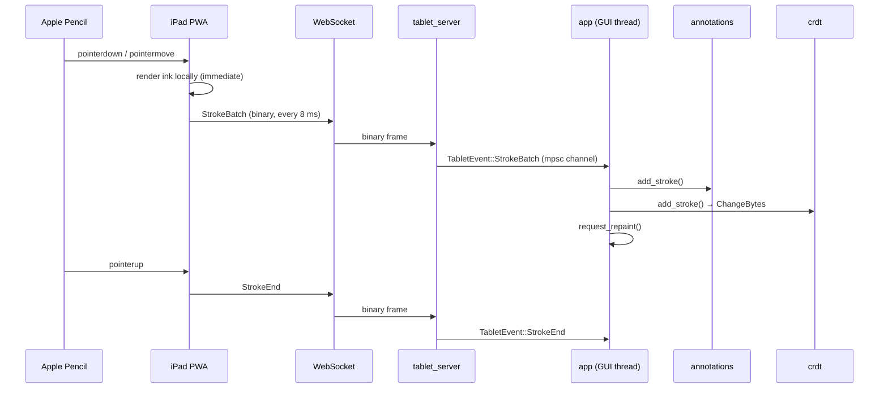
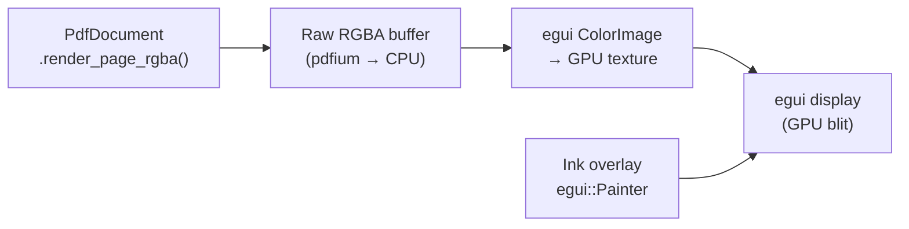
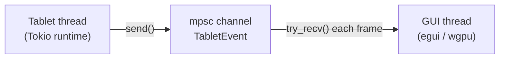
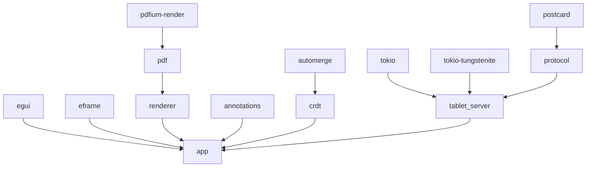

# Architecture

## System overview

## Module contracts

| Module | Inputs | Outputs | Must not depend on |
|--------|--------|---------|-------------------|
| `pdf/` | file path | `PdfDocument` | all other inkstone modules |
| `renderer/` | `&PdfDocument`, page idx, zoom | `egui::TextureId` | annotations, crdt, protocol |
| `annotations/` | stroke data | `&[InkStroke]` | all other inkstone modules |
| `crdt/` | stroke data | change bytes (`Vec<u8>`) | all other inkstone modules |
| `protocol/` | typed messages | encoded `Vec<u8>` | all other inkstone modules |
| `tablet_server/` | TCP stream | `TabletEvent` channel | app, pdf, renderer, annotations, crdt |
| `app/` | all of the above | egui frame | nothing external |

## Data flow: annotation lifecycle

## Rendering pipeline

The renderer caches the last GPU texture.  It only re-rasterises when the
page index **or** zoom changes.  This means:
- Scrolling within a page: 0 CPU work, 1 GPU blit.
- Page turn: one pdfium render (~5–20 ms), then cached.
- Zoom change: one pdfium render at new resolution.

## Threading model

The GUI thread never blocks.  It polls the mpsc channel at the start of each
frame and applies any pending stroke data before rendering.

## Dependencies

