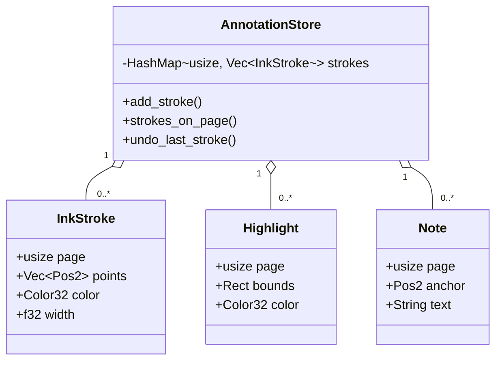

# Data model

## Annotation types



## CRDT document schema (Automerge)

The CrdtDoc models the same data in an Automerge document so that
changes from the iPad can be merged without conflicts.

```
Root Map
├── "strokes": List
│     └── Map (one per stroke)
│           ├── "id":    String   (UUID, used as idempotency key)
│           ├── "page":  u64
│           ├── "color": u64      (packed RGBA)
│           ├── "width": f64
│           └── "pts":  List
│                 └── List [x: f64, y: f64]
│
├── "highlights": List            (M4)
└── "notes": List                 (M4)
```

## Coordinate systems

```
PDF points (pdfium)         Screen pixels (egui)        Normalised [0,1] (iPad PWA)

origin: bottom-left         origin: top-left             origin: top-left
unit: 1/72 inch             unit: logical pixel          unit: fraction of page

(0,0) ─────────────►        (0,0) ──────────────►        (0,0) ────────────►
  │   pt_w pts               │   px_w pixels               │   1.0
  │                           │                              │
  ▼ pt_h pts                  ▼ px_h pixels                 ▼ 1.0
```

Conversion from normalised to screen pixels (used in M2 when applying
tablet strokes to the laptop annotation store):

```rust
let px_x = sample.x * renderer.last_size().x + page_rect.left();
let px_y = sample.y * renderer.last_size().y + page_rect.top();
```

`page_rect` is the `egui::Rect` returned by `ui.image(...)` in `app/mod.rs`.

## Sidecar file format (.ink)

A `.ink` file is the raw output of `automerge::AutoCommit::save()`.
It is a compact binary format (not human-readable).

```
file.pdf          ← the original, never modified
file.ink          ← sidecar: Automerge-serialised annotation doc
```

On open: load `.ink` if it exists, replay into `AnnotationStore`.
On annotate: append change bytes to the Automerge doc, save periodically.
