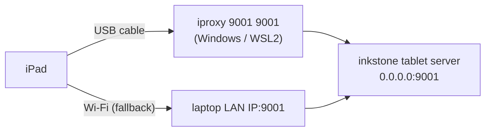

# iPad connectivity

## Transport options



## USB (preferred – ~1–3 ms latency)

USB eliminates Wi-Fi jitter and is the recommended connection for
latency-sensitive drawing.

### Windows setup

1. Install **iTunes** (or the Apple Devices app from the Microsoft Store).
   This installs the Apple Mobile Device USB driver and `usbmuxd`.
2. Install **libimobiledevice** tools (provides `iproxy`):
   - Download from https://github.com/libimobiledevice-win32/imobiledevice-net/releases
   - Or via `winget install libimobiledevice`
3. Plug in iPad via USB. Trust the computer on the iPad.
4. In a PowerShell window:
   ```powershell
   iproxy 9001 9001
   ```
   This creates a TCP tunnel: `localhost:9001` → iPad port 9001.
   Leave this running while you use inkstone.
5. On the iPad, open Safari and navigate to:
   ```
   http://127.0.0.1:9001
   ```
   (In M2, the inkstone tablet server will serve the PWA here.)

### WSL2 development note

When building in WSL2, the server runs in the WSL2 VM. Windows apps can
reach WSL2 via `localhost` (WSL2 auto-forwards ports), but `iproxy` runs
on the Windows side. The chain is:

```
iPad USB → iproxy (Windows) → localhost:9001 → WSL2 inkstone server
```

This just works as long as inkstone binds `0.0.0.0:9001` (which it does).

### Troubleshooting USB

| Symptom | Fix |
|---------|-----|
| `iproxy` says "no device found" | Unlock iPad, tap Trust on the dialog |
| Safari can't reach `127.0.0.1:9001` | Make sure inkstone is running with `--tablet` |
| Connection drops after a few seconds | Disable USB selective suspend in Windows power settings |

---

## Wi-Fi / LAN (fallback – ~5–15 ms latency)

Still fast enough for comfortable annotation; the latency is only
perceptible on very fast strokes.

1. Make sure both laptop and iPad are on the same network.
2. Find the laptop's local IP:
   ```powershell
   ipconfig | findstr IPv4
   # or in WSL2:
   ip addr show eth0
   ```
3. On the iPad, open Safari and navigate to:
   ```
   http://<laptop-ip>:9001
   ```
4. The Windows Firewall may block port 9001.  Allow it:
   ```powershell
   netsh advfirewall firewall add rule `
     name="inkstone tablet" `
     dir=in action=allow protocol=TCP localport=9001
   ```

---

## PWA service worker (M5)

In a later milestone the PWA will register a service worker so the drawing
surface works offline (with local buffering) and can be added to the iPad
home screen for a more native feel.  This is not implemented in M1/M2.

---

## Security note

The tablet server binds to `0.0.0.0:9001` and has **no authentication**.
It should only be started on trusted networks (home/campus LAN or USB).
Do not expose port 9001 to the internet.
